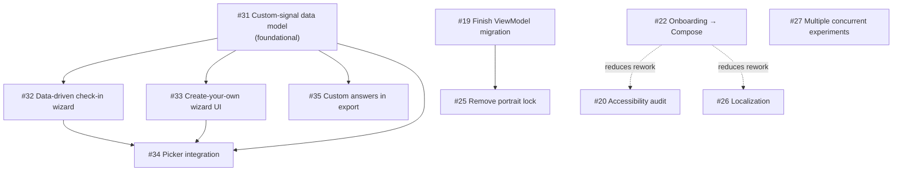

# Issue dependencies & merge-conflict risk

This file holds the part of agent coordination that **cannot be derived** from git or
GitHub: which issues block which, and which issues will collide in the same files even when
neither formally blocks the other.

**It deliberately does not track who is working on what.** That state is live and was the
thing that kept going stale in the old `COORDINATION.md`. Get it from:

```bash
pwsh -File scripts/agent-status.ps1
```

Claims live on the GitHub issues themselves (`agent:in-progress` label + assignee).

---

## Dependency graph



### Hard blockers

| Issue | Blocked by | Why |
|---|---|---|
| #32, #33, #35 | **#31** | All need the custom-signal Room schema first. |
| #34 | **#31, #32, #33** | Not end-to-end testable until the model, check-in flow, and a way to create an experiment all exist. |
| #25 | **#19** | The portrait lock exists *because* state didn't survive recreation. Removing it before the last three ViewModels land reintroduces state loss on rotation. |

### Soft ordering (not blocking, but wasteful to invert)

- **#22 before #20** — auditing the legacy `view/` zoo for accessibility, then deleting that
  zoo in the Compose migration, is throwaway work. Do #22 first, or scope #20 to
  Compose-only screens.
- **#22 before #26** — same argument for externalizing strings out of doomed layouts.
- **#26 is externally blocked** on target locales being chosen (product input). Don't claim
  it expecting to finish.

---

## File-overlap / merge-conflict risk

Two agents can work these concurrently only if they stay in different rows.

| Hot spot | Issues that touch it | Notes |
|---|---|---|
| **Room schema + migrations** (`database/`, `ExperimentRepository`) | **#31, #27** | Highest risk in the repo. Both add entities/columns and need migrations. **Do not run concurrently** without agreeing the migration version order first. |
| `viewmodel/` package | #19, #32, #33 | #19 adds three ViewModels; #32 restructures `CheckinViewModel`'s step list; #33 adds `CreateExperimentViewModel`. New files mostly — low collision, but #32 rewrites an existing one. |
| `assets/experiment_types.json` + `ExperimentTypeRegistry` | #28, #31, #34 | #28 appends config entries; #31 makes the registry accept user-defined types. Small file, near-certain textual conflict. |
| `ExperimentChooseActivity` | #28, #34 | #28 adds `chooseOrder` entries; #34 rewrites how the list is built. |
| `AndroidManifest.xml` | #25, #18, #22 | #25 strips `screenOrientation`/`configChanges`; #18 adds a rationale activity; #22 removes legacy activities. |
| `activities/questions/` + `view/` | #22, #20 | #22 deletes most of this; see soft ordering above. |
| `data/ExperimentExporter` | #35, #27 | #35 adds custom-signal fields; #27 changes what "an experiment" is. |
| `app/build.gradle` | #23, #10 (CI emulator) | Dependency churn; conflicts are usually trivial to resolve. |
| `strings.xml` | #26, #28, #22 | Append-only from different issues; easy conflicts. |

---

## Standing constraints

- **`engine/ExperimentEngine.kt` is the research algorithm.** Changes are product decisions,
  not refactors. Verify against `ExperimentEngineTest` and
  `ExperimentEngineCharacterizationTest` (an oracle ported from the original Django source).
  #23's Joda→`java.time` swap touches this — highest-care item in that issue.
- **No networking.** No backend, no account, no silent network calls. Not an oversight.
- **No emulator in CI.** Anything UI-facing lands unverified on-device unless a human or an
  agent with adb runs it. Say so explicitly in the PR.

---

*Update this file when a dependency changes or a new hot spot appears — not every session.
If you find yourself editing it every time you touch the repo, you are probably recording
derivable state that belongs in `scripts/agent-status.ps1` instead.*
