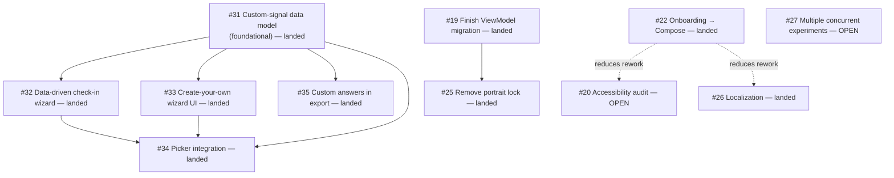

# Issue dependencies & merge-conflict risk

This file holds the part of agent coordination that **cannot be derived** from git or
GitHub: which issues block which, and which issues will collide in the same files even when
neither formally blocks the other.

**It deliberately does not track who is working on what.** That state is live and was the
thing that kept going stale in the old `COORDINATION.md`. Get it from:

```bash
pwsh -File scripts/agent-status.ps1
```

Claims live on the GitHub issues themselves (`agent:in-progress` label + assignee).

---

## Dependency graph (historical — fully resolved)

The graph below drove the 2026-07-22 batch (#19, #20's soft ordering, #22, #25, #26, and the
#31–#35 custom-signal epic). Every node except **#20** has since landed — #31–#35 merged as
PR #45, #49, #50, #52, #51; #19/#22/#25/#26 as PR #40/#46/#48/#47. Kept here as a worked
example of how this file's blocking/soft-ordering notation reads, and because the file-overlap
lessons below (Room schema, `experiment_types.json`, etc.) still apply to whoever touches those
areas next.


```mermaid
graph TD
    I31["#31 Custom-signal data model<br/>(foundational) — landed"]
    I32["#32 Data-driven check-in wizard — landed"]
    I33["#33 Create-your-own wizard UI — landed"]
    I34["#34 Picker integration — landed"]
    I35["#35 Custom answers in export — landed"]
    I19["#19 Finish ViewModel migration — landed"]
    I25["#25 Remove portrait lock — landed"]
    I22["#22 Onboarding → Compose — landed"]
    I20["#20 Accessibility audit — OPEN"]
    I26["#26 Localization — landed"]
    I27["#27 Multiple concurrent experiments — OPEN"]

    I31 --> I32
    I31 --> I33
    I31 --> I35
    I31 --> I34
    I32 --> I34
    I33 --> I34
    I19 --> I25
    I22 -.->|"reduces rework"| I20
    I22 -.->|"reduces rework"| I26
```

### What's actually still open

| Issue | Notes |
|---|---|
| **#20** — Accessibility audit beyond check-in | `#22` (its soft-order predecessor) landed, so there's no more throwaway-work risk in claiming this now — the legacy `view/` zoo it would have had to audit is already deleted. |
| **#27** — Multiple concurrent experiments | Touches the same Room schema area the #31–#35 epic just finished touching. See the hot-spot table below before starting. |
| **#18** — Health Connect Play-readiness | No known dependency on anything above. |
| **#63** — `connectedDebugAndroidTest` hangs on-device | Independent; touches CI/test infra, not the areas above. |

No hard blockers or soft-ordering concerns exist among the currently-open set (#18, #20, #27,
#63) — they don't share files and none depends on another. Two agents can pick any two of them
concurrently.

---

## File-overlap / merge-conflict risk

Two agents can work these concurrently only if they stay in different rows.

| Hot spot | Issues that touched it | Notes |
|---|---|---|
| **Room schema + migrations** (`database/`, `ExperimentRepository`) | ~~#31, #27~~ #31 landed | #31 added the custom-signal entities/columns. **#27 (still open) is the one live risk left here** — it will add/change entities in the same area #31 just finished migrating. Agree migration version order before starting #27; nothing else currently touches this schema. |
| `viewmodel/` package | ~~#19, #32, #33~~ all landed | No longer a live hot spot — no open issue currently touches `viewmodel/`. |
| `assets/experiment_types.json` + `ExperimentTypeRegistry` | ~~#28, #31, #34~~ all landed | No longer a live hot spot. |
| `ExperimentChooseActivity` | ~~#28, #34~~ both landed | No longer a live hot spot. |
| `AndroidManifest.xml` | **#18** (open), ~~#22, #25~~ landed | #18 would add a Health Connect rationale activity — the only open issue touching the manifest right now. |
| `activities/questions/` + `view/` | ~~#22, #20~~ | Deleted by #22; moot now (#20 no longer risks throwaway work — see dependency graph above). |
| `data/ExperimentExporter` | ~~#35~~ landed, **#27** (open) | #27 changing what "an experiment" is will likely touch export too. |
| `app/build.gradle` | ~~#23~~ (partially landed — see `IMPROVEMENTS.md` §4 note on the orphaned gson/dependency-drop work), #10 (CI emulator, no issue yet) | Dependency churn; conflicts are usually trivial to resolve. |
| `strings.xml` | ~~#26, #28, #22~~ all landed | No longer a live hot spot. |

The only genuinely live overlap risk today is **Room schema** (#27 alone, but building on what
#31 just changed) and **`AndroidManifest.xml`** (#18 alone). Everything else in this table is
historical.

---

## Standing constraints

- **`engine/ExperimentEngine.kt` is the research algorithm.** Changes are product decisions,
  not refactors. Verify against `ExperimentEngineTest` and
  `ExperimentEngineCharacterizationTest` (an oracle ported from the original Django source).
  The Joda→`java.time` swap (#23) and the custom-signal model (#31) both touched this area and
  are the template for how carefully to verify future changes here.
- **No networking.** No backend, no account, no silent network calls. Not an oversight.
- **No emulator in CI, and `androidTest` doesn't currently run even manually.** Anything
  UI-facing lands unverified on-device unless a human or an agent with adb runs it and says so
  explicitly in the PR. Per issue #63, even a manual `connectedDebugAndroidTest` run on a real
  device currently hangs indefinitely rather than completing — don't assume a green
  `assembleDebugAndroidTest` (compile-only) means the instrumentation suite actually passed.

---

*Update this file when a dependency changes or a new hot spot appears — not every session.
If you find yourself editing it every time you touch the repo, you are probably recording
derivable state that belongs in `scripts/agent-status.ps1` instead.*
